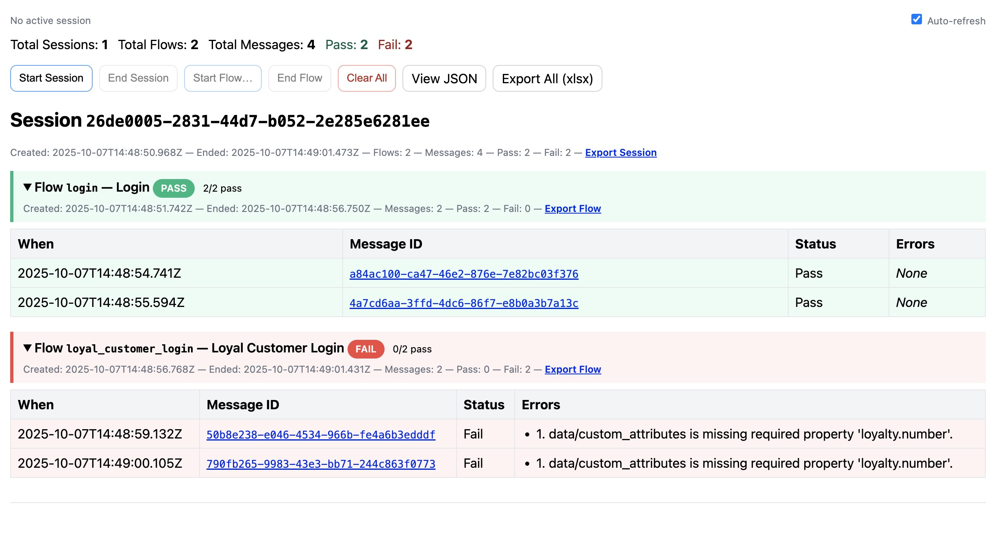

# RequestWeaver – Stateful API Request Validator

RequestWeaver is a sidecar validator and dashboard that mirrors live API requests (via a proxy like mitmproxy) and validates them using **JSON Schema** and **custom cross-request rules**. Requests are organized into **Sessions → Flows → Messages** so you can validate end-to-end scenarios without changing your app or backend.

**In practice:** point your device/app at a proxy → traffic still reaches your real API → a copy is sent to RequestWeaver → you see live results, errors, and exports.

---

## Features

* **Mirror & validate** without breaking the original call (pass-through proxy)
* **Sessions & Flows**: start/stop from your test harness to group related requests
* **Schema validation** with Ajv (+ `ajv-formats`)
* **Custom rules**, including **cross-message** checks inside a flow
* **Dashboard** with live auto-refresh, message detail, and **XLSX exports**
* **Extensible**: teams add flows & schemas under `extensions/` — no framework edits
* **Docker-ready** with a simple Compose file

---
## Architecture


---

---
## Dashboard


---

## Quick Start (Docker Compose)

**Prerequisites:** Docker Desktop/Engine.

```bash
# 1) Pre-create consumer extension folders (owned by test teams)
mkdir -p extensions/common-schemas extensions/flows

# 2) (Optional) mitmproxy addon/state folders
mkdir -p mitm/addons mitm/state

# 3) Bring everything up
docker compose up --build
```

* Dashboard: [http://localhost:8000/dashboard/html](http://localhost:8000/dashboard/html)
* Health: [http://localhost:8000/test](http://localhost:8000/test)

### Example `docker-compose.yml`

```yaml
version: "3.9"

services:
  validator:
    build: .
    environment:
      PORT: "8000"
      EXTENSIONS_DIR: /workspace/extensions
    volumes:
      - ./extensions:/workspace/extensions:ro
    ports:
      - "8000:8000"
    healthcheck:
      test:
        [
          "CMD-SHELL",
          "node -e \"http=require('http');http.get('http://127.0.0.1:8000/test',r=>process.exit(r.statusCode===200?0:1)).on('error',()=>process.exit(1))\""
        ]
      interval: 5s
      timeout: 3s
      retries: 30
      start_period: 40s

  mitmproxy:
    image: mitmproxy/mitmproxy:latest
    depends_on:
      validator:
        condition: service_started
    ports:
      - "8080:8080"   # proxy
      - "8081:8081"   # mitmweb UI (optional)
    volumes:
      - mitm_state:/home/mitmproxy/.mitmproxy
      - ./mitm/addons:/addons:ro
    command: >
      mitmdump
      -p 8080
      -s /addons/simplified_mirror.py
      --set mirror_base=http://validator:8000
      --set mirror_match=http://validator:8000

volumes:
  mitm_state:
```

**Notes**

* Point your iOS/Android device to your machine’s IP as HTTP Proxy on port **8080**.
* Install and trust the mitmproxy CA from `mitm/state/mitmproxy-ca-cert.pem`.
* Apps with TLS certificate pinning cannot be intercepted.

---

## Repo Layout

```
src/                     # framework code (no edits needed to consume)
  server.js              # starts HTTP server
  app.js                 # Express app (views, routes, middleware)
  index.js              # PORT, EXTENSIONS_DIR, …
  core/engine.js         # loads per-flow validators + resolves schemas
  store/state.store.js   # in-memory Sessions/Flows/Messages
  services/              # validation, dashboard model, exports
  controllers/           # route handlers
  config/                # config
  routes/                # express routers
  views/                 # EJS templates (dashboard.ejs, message.ejs)
  public/                # CSS/JS (state.css, …)

```

---

## Using the Dashboard

* `GET /dashboard/html` — Auto-refresh UI (context-aware buttons)

  * Start/End **Session**
  * Start/End **Flow**
  * **Clear All** (wipes memory)
  * Expand a flow to view **Messages**; click a **Message ID** for full detail
* `GET /dashboard/data` — JSON model for the UI
* `GET /messages/:messageId` — Message detail (HTML)
* `GET /messages/:messageId.json` — Message detail (JSON)

---

## API (Sessions / Flows / Ingest)

```http
POST   /sessions                   → { ok, sessionId }   # starts a new session (auto-ends any previous)
POST   /sessions/end               → { ok }
POST   /flows                      → { ok, flowId }      # body: { flowId, name? } (alnum + underscore)
POST   /flows/end                  → { ok }
POST   /                           → validate message body (requires active session + flow)
GET    /test                       → "Validator OK"
GET    /dashboard/html             → HTML
GET    /dashboard/data             → JSON
GET    /messages/:messageId        → HTML detail
GET    /messages/:messageId.json   → JSON detail
DELETE /state                      → clear all sessions/flows/messages
```

**Sticky semantics:** at most one **current session** and one **current flow** at a time; your test harness controls when to start/stop.

---

## Extensions: Add Flows, Schemas & Custom Rules (for consumers)

Consumers **only** edit the `extensions/` folder.

```bash
# Example: create a new flow
mkdir -p extensions/flows/checkout/schemas
```

**`extensions/flows/checkout/index.js`**

```js
module.exports = {
  // Return a string or an array of strings:
  //  - "schemas/order.schema.json"           (relative to this flow folder)
  //  - "@common/payment-method.schema.json"  (from extensions/common-schemas)
  selectSchema(message /*, ctx */) {
    if (message?.type === "order")   return "schemas/order.schema.json";
    if (message?.type === "payment") return "@common/payment-method.schema.json";
    return null; // engine fallback (single-file heuristic in ./schemas)
  },

  // Additional custom checks. Return [] if all good.
  validate(message, ctx) {
    const errs = [];

    // Simple attribute rule
    if (message?.channel !== "ios") {
      errs.push("channel must equal 'ios'.");
    }

    // Cross-message example: payment must follow an order in the same flow
    if (message?.type === "payment") {
      const priorOrders = ctx.findEvents({
        flowId: ctx.flowId,
        where: e => e.message?.type === "order"
      });
      if (priorOrders.length === 0) {
        errs.push("Payment arrived before any order in this flow.");
      }
    }
    return errs;
  }
};
```
## Consumer Starter

To get going quickly, copy the starter into your own repo:

```bash
rsync -a templates/consumer-starter/ ./my-tests/
cd my-tests
cp .env.example .env
docker compose up --build
```

* Dashboard: http://localhost:${PORT:-8000}/dashboard/html
* (Optional) Start with mitmproxy sidecar: docker compose --profile mitm up --build

### Schema resolution

1. Whatever you return from `selectSchema()`:

   * Relative path (e.g., `"schemas/order.schema.json"`) → resolved **inside the flow folder**
   * `@common/<file>.json` → resolved in `extensions/common-schemas/<file>.json`
   * Array of strings → validates against **all** (aggregate errors)
2. Fallback: if `./schemas` has exactly **one** `.json`, it’s used.

RequestWeaver uses **Ajv** with `ajv-formats`.

---
## Docker Run
```
docker run --rm -p 8000:8000 -e EXTENSIONS_DIR=/workspace/extensions \
  -v "$(pwd)/extensions:/workspace/extensions:ro" requestweaver:local

```

## Exports

* **All messages:** `GET /export/all.xlsx`
* **By session:** `GET /sessions/:sessionId/export.xlsx`
* **By flow:** `GET /sessions/:sessionId/flows/:flowId/export.xlsx`

Columns: **Message ID**, Session ID, Flow ID, Timestamp, Status, Errors, **Message (JSON)**.

---
## Mirror Proxy Setup

For a quick start, I have created a simple mirroring addon(on mitmproxy) to pass traffic through to your API while mirroring a copy to RequestWeaver.
You can find the repo [here](https://github.com/karthik-krishnan/mitm-mirror). 

* Example command:

  ```bash
  docker run --rm -it \
  -p 8080:8080 \
  -e MIRROR_BASE=http://host.docker.internal:8000 \
  -e MIRROR_PATH=/ \
  -e MIRROR_MATCH=http://api.example.com \
  ghcr.io/karthik-krishnan/mitm-mirror:1.0.0
  ```

* In Docker Compose, point to the validator by **service name**:

  ```yaml
  command: >
    mitmdump -p 8080 -s /addons/simplified_mirror.py
      --set mirror_base=http://validator:8000
      --set mirror_match=http://validator:8000
  ```

> iOS/macOS: if you intercept HTTPS, install and **trust** the mitmproxy CA. TLS-pinned apps cannot be intercepted.

---

## Troubleshooting

* **No messages appear**

  * Start a **Session** and a **Flow** first.
  * Ensure the mirror script POSTs the raw JSON body to `/`.
* **Healthcheck blocks mitmproxy**

  * Use the Node-based healthcheck above or increase `start_period`.
* **Bind-mount errors**

  * Pre-create `extensions/` (and `mitm/addons`) before `docker compose up`.
* **Permission denied (mitm state)**

  * Prefer a **named volume** (`mitm_state`) or pre-chown/chmod the host folder.
* **Regex gotchas in mirror match**

  * `.` matches any character; escape with `\.` or compare host/port directly.

---

## Advanced (for framework contributors)

* **Engine:** `src/core/engine.js`
  Exports: `getValidatorForFlow(flowId, { ajv, flowsDir, commonSchemasDir })`
* **Persistence:** replace `src/store/state.store.js` with a DB/Redis driver (keep method signatures)
* **Kubernetes:** run mitmproxy and RequestWeaver as separate Deployments; mount `extensions/` via ConfigMap/volume; mirror by Service DNS
* **Observability:** add structured logs/metrics; expose Prometheus counters (`messages_total`, `valid_total`, `invalid_total`)

---

## Local Development

```bash
npm i
npm run dev   # e.g., "nodemon --legacy-watch src/server.js"
# then open http://localhost:8000/dashboard/html
```

**Environment variables:**

* `PORT` (default `8000`)
* `EXTENSIONS_DIR` (default `./extensions` when running from repo)

---

## License

MIT © Karthik Krishnan

---

**Project metadata**

RequestWeaver – Stateful API Request Validator · request weaver · api validator · stateful · cross-request · schema · mitmproxy · sessions · flows · dashboard · xlsx export
